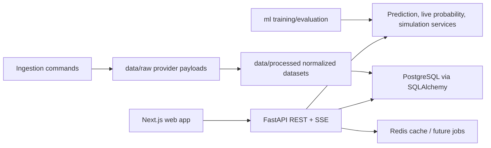

# Architecture

World Cup Insights is a portfolio monorepo with a clear split between user experience, API/domain logic, ML experimentation and data storage.

## Data Flow

1. Ingestion commands fetch provider data.
2. Raw API responses are stored for auditability.
3. Normalizers upsert teams, players, matches, events, broadcasts and live snapshots.
4. API endpoints expose typed product views.
5. Frontend renders seeded fallback data if the API is not running.

## Live Updates

The API exposes `GET /live/matches/{match_id}/stream` as an SSE starter. A production version should add:

- cached provider polling,
- configurable polling interval,
- raw response storage,
- replayable event history,
- WebSocket fanout for high-frequency match pages.

## Norwegian Broadcast Safety

The backend validates seeded links against allowed official hosts: `nrk.no`, `tv.nrk.no`, `tv2.no` and `play.tv2.no`. The product should never embed illegal streams.

