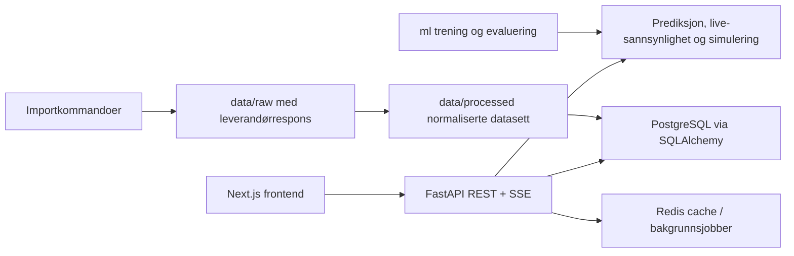

# Arkitektur

VM Dashboard og Predikering er et portfolio-monorepo med tydelig skille mellom brukeropplevelse, API-/domenelogikk, ML-eksperimentering og datalagring.

## Dataflyt

1. Importkommandoer henter data fra konfigurerte kilder.
2. Rå API-responser lagres for sporbarhet.
3. Normalisering oppdaterer lag, spillere, kamper, hendelser, sendinger og live snapshots.
4. API-et eksponerer typede produktvisninger til frontend.
5. Frontend viser seedet fallback hvis API-et ikke svarer.

## Liveoppdateringer

API-et eksponerer `GET /live/matches/{match_id}/stream` som første SSE-flyt. En mer robust produksjonsvariant bør legge til:

- cachet polling mot dataleverandør,
- konfigurerbart polling-intervall,
- lagring av rårespons,
- replaybar hendelseshistorikk,
- WebSocket-fanout for kampsider med høy oppdateringsfrekvens.

## Norske sendelenker

Backend validerer sendelenker mot tillatte offisielle domener: `nrk.no`, `tv.nrk.no`, `tv2.no` og `play.tv2.no`. Produktet skal aldri embedde eller lenke til ulovlige streams.

